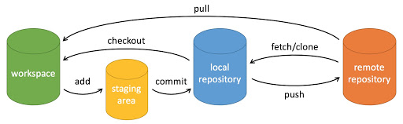

# Git

## 简述

Git 作为协作开发所必要的代码版本管理工具，学习其的必要性可谓是不言而喻的。虽然当下许多 IDE 与编辑器已然内置了可视化的 Git 操作工具，但正如腰子哥所言，GUI 是给那些不会使用 Git 的人所使用的。我个人认为 GUI 固然具有其优点，然而从另一个角度来看，对于开发者而言这样一种不可见的 Git 命令“黑盒”显然是极有可能导致意料之外的操作结果的。因此无论如何我们都建议同学们作为开发者能够在做锅的同时能过认真的去学习 Git 相关的概念与使用命令。

## 基本概念

<figure><figcaption><p>Git 基本操作</p></figcaption></figure>

| 名称                | 翻译   | 解释          |
| ----------------- | ---- | ----------- |
| workspace         | 工作区  | 编辑代码的工作区域   |
| staging area      | 暂存区  | 暂时存放改动代码的区域 |
| local repository  | 本地仓库 | 本地用于存放代码的仓库 |
| remote repository | 远程仓库 | 远程用于存放代码的仓库 |

## 配置

### 基础配置

```bash
git config [--global] user.name [name]
git config [--global] user.email [email address]
```

使用 Git 提交代码至少需要先配置昵称与邮箱

### SSH 配置

```bash
ssh-keygen -t rsa -C [email address] //生成私钥与公钥
```

```bash
cat ~/.ssh/id_rsa.pub //查看生成的公钥
```

公钥上传Github即可

> 关于 ssh-keygen [https://www.jianshu.com/p/dd053c18e5ee](https://www.jianshu.com/p/dd053c18e5ee)

### 配置代理

```bash
git config --global http.proxy http://localhost:7890
git config --global https.proxy socks5://localhost:7890
```

一般而言，socks5 的下载速度是要快于 http 与 https 的

## 基本命令

### 初始化

|        | 命令                       | 解释                  |
| ------ | ------------------------ | ------------------- |
| 克隆代码库  | git clone \[url]         | 下载一个项目和它的整个代码历史     |
| 初始化代码库 | git init                 | 在当前目录新建一个Git代码库     |
|        | git init \[project-name] | 新建一个目录，将其初始化为Git代码库 |

### 暂存

|        | 命令                                      | 解释                                   |
| ------ | --------------------------------------- | ------------------------------------ |
| 添加代码改动 | git add \[file1] \[file2] ...           | 添加指定文件到暂存区                           |
|        | git add \[dir]                          | 添加指定目录到暂存区，包括子目录                     |
|        | git add .                               | 添加当前目录的所有文件到暂存区                      |
|        | git add -p                              | 添加每个变化前，都会要求确认。对于同一个文件的多处变化，可以实现分次提交 |
| 移除代码改动 | git rm \[file1] \[file2] ...            | 删除工作区文件，并且将这次删除放入暂存区                 |
|        | git rm --cached \[file]                 | 停止追踪指定文件，但该文件会保留在工作区                 |
|        | git mv \[file-original] \[file-renamed] | 改名文件，并且将这个改名放入暂存区                    |

### 提交

|        | 命令                                             | 解释                                                   |
| ------ | ---------------------------------------------- | ---------------------------------------------------- |
| 提交代码改动 | git commit -m \[message]                       | 提交暂存区到仓库区                                            |
|        | git commit \[file1] \[file2] ... -m \[message] | 提交暂存区的指定文件到仓库区                                       |
|        | git commit -a                                  | 提交工作区自上次commit之后的变化，直接到仓库区                           |
|        | git commit -v                                  | 提交时显示所有diff信息                                        |
|        | git commit --amend -m \[message]               | 使用一次新的commit，替代上一次提交。如果代码没有任何新变化，则用来改写上一次commit的提交信息 |
|        | git commit --amend -m \[message]               | 重做上一次commit，并包括指定文件的新变化                              |

## 其他

推荐借助 [https://learngitbranching.js.org/](https://learngitbranching.js.org/) 学习相关 git 命令

## 参考

* [https://www.bootcss.com/p/git-guide/](https://www.bootcss.com/p/git-guide/)
* [https://www.ruanyifeng.com/blog/2015/12/git-cheat-sheet.html](https://www.ruanyifeng.com/blog/2015/12/git-cheat-sheet.html)
* [https://segmentfault.com/a/1190000039241242](https://segmentfault.com/a/1190000039241242)
